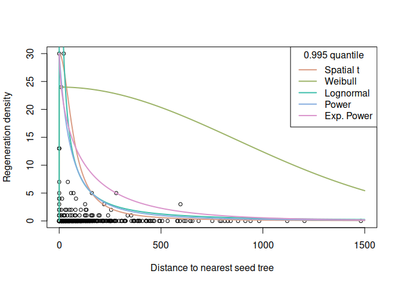
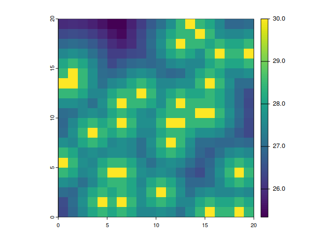

<!-- README.md is generated from README.Rmd. Please edit that file -->

# quaxnat

<!-- badges: start -->
<!-- badges: end -->

An R package for estimating the regeneration potential using large scale
inventory information.

## Description

Regeneration datasets, especially those pertaining to rare tree species,
often exhibit values that are below the real regeneration potential due
to various factors influencing or hindering natural regeneration. The R
package *quaxnat* implements a quantile regression approach for
estimating the regeneration potential, following the methodology of
[Axer et al. (2021)](https://doi.org/10.1016/j.foreco.2020.118802). This
quantile regression method quantifies the impact of the distance to the
nearest seed source on natural regeneration densities not considering
other influencing variables. The function `quax` we provide is a simple
implementation of the quantile estimation. It presents a rather naive
approach to quantile regression and, while likely outperformed by more
sophisticated procedures such as those in the R package *quantreg*
[(Koenker et al., 2023)](https://CRAN.R-project.org/package=quantreg) in
general quantile regression problems, appears to work reasonably well in
the situation considered here.

The package provides various dispersal kernels that have proven useful
in modeling seed dispersal:

- Spatial t distribution
- Weibull distribution
- Lognormal distribution
- Power distribution
- Exponential power distribution

Within the `quax` function the dispersal kernel is defined by *fun*.
Additional kernels can be provided as user-defined functions.

## Installation

The *quaxnat* package is available on
[Github](https://github.com/MaximilianAxer/quaxnat). To install the
development version, run the following code:

``` r
remotes::install_github("MaximilianAxer/quaxnat")
```

## Usage

This section illustrates the use of the quax function with step-by-step
explanations of the computation.

``` r
# Load quaxnat package
library(quaxnat)

# Load example data
data("regeneration")
```

After loading the *quaxnat* package, we are now ready to apply the
`quax` function, which we do for example for the *.995th* quantile and
five dispersal kernels implemented in *quaxnat*.

``` r
# Estimate regeneration potential based on various dispersal kernels
tau <- 0.995
f1 <- quax(oak_regen ~ distance_oak, regeneration, tau=tau, fun=k_t)
f2 <- quax(oak_regen ~ distance_oak, regeneration, tau=tau, fun=k_weibull)
f3 <- quax(oak_regen ~ distance_oak, regeneration, tau=tau, fun=k_lognormal)
f4 <- quax(oak_regen ~ distance_oak, regeneration, tau=tau, fun=k_power)
f5 <- quax(oak_regen ~ distance_oak, regeneration, tau=tau, fun=k_exponential_power)

f <- list(`Spatial t`=f1, Weibull=f2, Lognormal=f3, Power=f4, `Exp. Power`=f5)
```

The results of the quantile regression for the different dispersal
kernels can be visualised and compared. We are now ready to add the
estimated functions to the plot. Since `quax` directly returns those
functions, this is conveniently done with the `curve` function.

``` r
# Plot regeneration density as a function of the distance to the nearest seed tree
plot(oak_regen ~ distance_oak, regeneration, xlim=c(0, 1500), cex=0.8,
     xlab="Distance to nearest seed tree", ylab="Regeneration density")

# Add estimated functions to diagram
col <- hcl.colors(length(f), palette="Dynamic")
for (i in seq_along(f)){
  curve(f[[i]](x), add=TRUE, n=10000, col=col[i], lwd=2)
}
legend("topright", title=paste0(tau," quantile"),
       legend=names(f), lty=1, lwd=2, col=col)
```



For the `quax` objects returned by the `quax` function, `summary`
outputs the estimated coefficients and the attained value of the
objective function. The latter can be used to compare fits of different
dispersal kernels for the same quantile to the same data.

``` r
# Compare quality of fits
sapply(f, summary)
#>              Spatial t Weibull   Lognormal Power     Exp. Power
#> coefficients numeric,2 numeric,2 numeric,2 numeric,2 numeric,2 
#> value        45.99978  151.7906  131.241   45.92098  46.46311
```

A prediction for the entire study area is made with the `predict_quax`
function. A `distmap` with distances to the nearest seed tree is used
for the prediction of the potential regeneration densities. Furthermore,
the parameterized `quax` object is used for the prediction.

``` r
# Create raster data set as prediction area
rr <- terra::rast(matrix(sample(0:10, 20 * 20, replace = TRUE), nrow = 20, ncol = 20))

# Compute distances to seed trees for prediction area
dists <- seed_tree_distmap(raster = rr, species = "10")

# Predict the potential regeneration density
regen_dens <- predict_quax(dists, f5)
terra::plot(regen_dens)
```



## Authors and contributors

- Maximilian Axer *(main author of the package)*
- Robert Schlicht *(author of the package)*
- Robert Nuske *(help with package development)*

## License

GPL (\>=2)

## Literature

*Axer et al. “Modelling potential density of natural regeneration of
European oak species (Quercus robur L., Quercus petraea (Matt.) Liebl.)
depending on the distance to the potential seed source: Methodological
approach for modelling dispersal from inventory data at forest
enterprise level.” Forest Ecology and Management 482 (2021): 118802.*

*Koenker et al. “Package ‘quantreg’.” Reference manual available at
CRAN: <https://cran.r-project.org/package=quantreg> (2023).*
